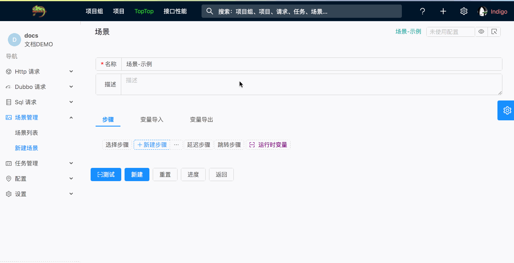
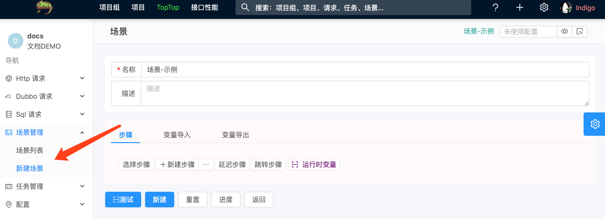
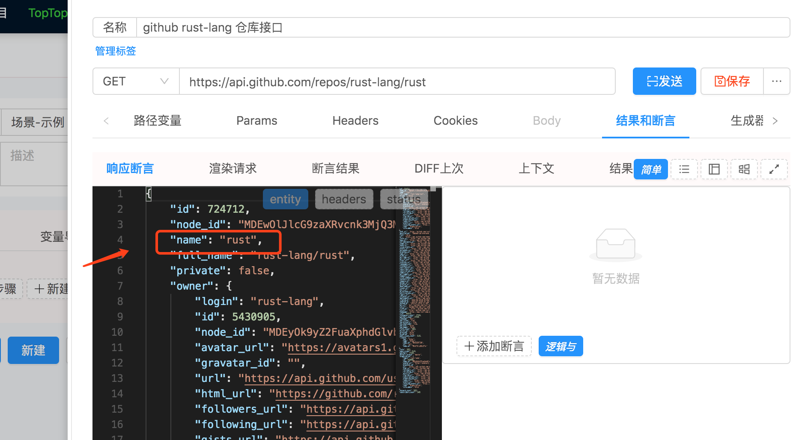
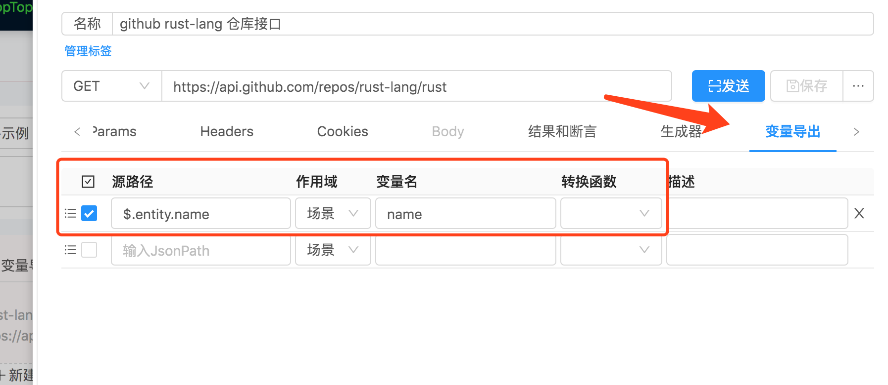
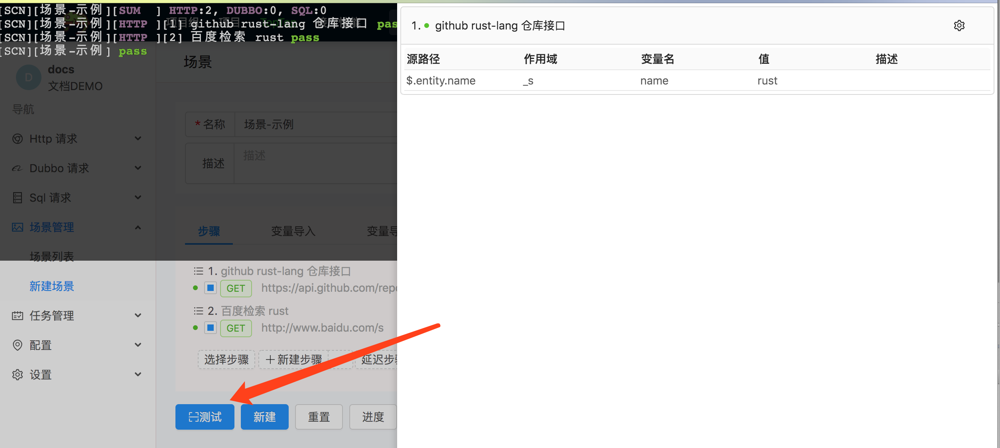
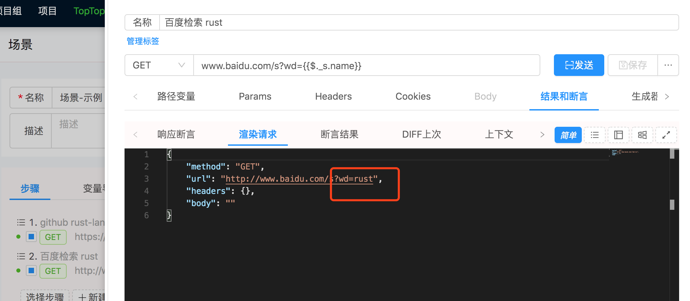

# 创建一个场景

> 这个场景的作用是:

1. 请求 `https://api.github.com/repos/rust-lang/rust` 获得响应体里面的 `name` 字段值
2. 百度检索 `第一步` 中值.

## 1. 进入创建场景的界面

> 

## 2. 添加步骤

### 步骤 1: 访问 github 接口

> 
> 想使用这个 `name` 的值进行百度检索.

> 
> 把 `name` 值导出到, `场景` 上下文作用域, 变量名仍为 `name`.

### 步骤 2: 百度上步的 `name` 值 `rust`

> 这是第二个请求步骤. `{{$._s.name}}`,用`{{` 和 `}}`指示要用[上下文](../context)中的数据进行渲染或执行脚本.`$._s.name` 指引用上下文中 `场景作用域(s)` 中的 `name` 变量值.

## 3. 测试&新建

> 点击 `测试` 按钮,就可以看到以下步骤二请求中被渲染的值.

>  > 

## 4. 快速失败选项

> `快速失败` 默认是选择状态, 即场景中前面一步失败后, 后面的步骤会跳过不执行. 若取消选中, 则不管上一步是否失败, 后面的步骤都会执行.
>
> 
