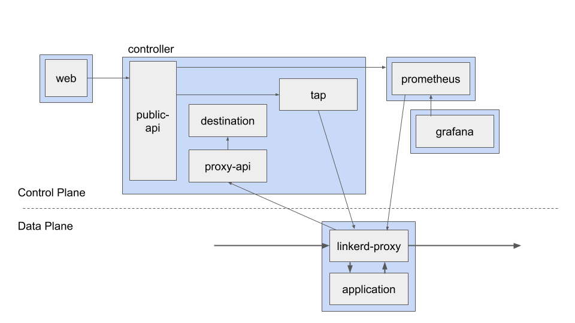

# 架构

> https://linkerd.io/2/reference/architecture/

> 在一个更高的抽象级别, `Linkerd` 由 `Control plane` 和 `Data plane`.

## Control Plane

> `control plane` 是运行在一个特定 `namespace` (默认是 `linkerd`) 中的一组服务. 这组服务负责: 聚合遥测数据, 提供一个面向用户的 API, 提供控制数据给 `data plane proxies` 等. 总之, 它们驱动 `data plane` 的行为.

`control plane` 由四个组件组成:

- Controller

> 包含 `public-api`, `proxy-api`, `destination`, `tap` 几个容器, 提供 `control plane` 的主要功能.

- Web

> linkerd dashboard.

- Prometheus

> scrap metrics exposed by linkerd.

- Grafana

> render and display these dashboard.

## Data Plane

> `data plane` 由一组和服务实例一块运行的透明代理组成. 这些代理自动处理所有流向和流流出服务的网络流量. 因为这些代理是透明的, 它们就像装有各种测量器具的进程外网络栈, 会向 `control plane` 发送遥测数据并接收控制信号.

> The Linkerd data plane is comprised of lightweight proxies, which are deployed as sidecar containers alongside each instance of your service code.

## Proxy

> The proxy is installed into each pod of a service and becomes part of the data plane. It receives all incoming traffic for a pod and intercepts all outgoing traffic via an `initContainer` that configures `iptables` to forward the traffic correctly.
