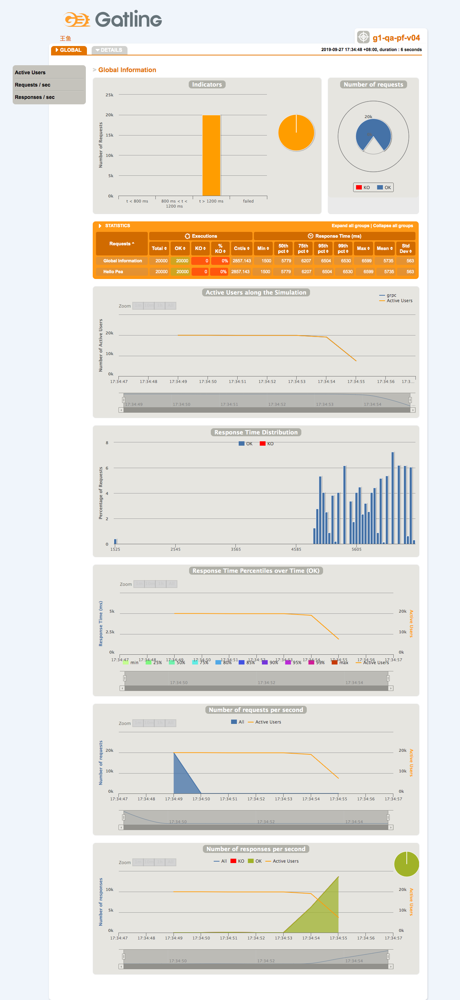

# Grpc 示例

## 压测脚本

```scala
import asura.pea.gatling.PeaSimulation
import asura.pea.grpc.Predef._
import io.gatling.core.Predef._
import io.grpc.netty.NettyChannelBuilder
import io.grpc.{Context, Metadata, Status}
import pea.grpc.hello.{HelloRequest, HelloServiceGrpc}

class HelloGrpcSimulation extends PeaSimulation {
  override val description: String =
    """
      |Grpc simulation example
      |""".stripMargin
  val grpcProtocol = grpc(
    NettyChannelBuilder.forAddress("localhost", 50051).usePlaintext()
  )
  val TokenHeaderKey = Metadata.Key.of("token", Metadata.ASCII_STRING_MARSHALLER)
  val TokenContextKey = Context.key[String]("token")
  val scn = scenario("grpc")
    .exec(
      grpc("Hello Pea")
        .rpc(HelloServiceGrpc.METHOD_SAY_HELLO)
        .payload(HelloRequest.defaultInstance.updateExpr(
          _.greeting :~ "pea"
        ))
        .header(TokenHeaderKey)("token")
        .check(
          statusCode is Status.Code.OK,
        )
        .extract(_.reply.some)(
          _.is("hi, pea")
        )
    )
  setUp(
    scn.inject(atOnceUsers(10000))
  ).protocols(grpcProtocol)
}
```

## 报告


