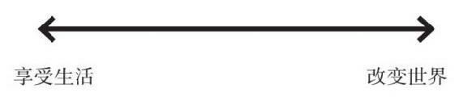

# 我的历程
> 年轻时，我仰慕那些极为成功的人，觉得他们因为非凡而成功。当我认识这样的人后，我发现他们都像我，像所有人一样会犯错误，会为自己的弱点挣扎，我也不再觉得他们特别与众不同、特别伟大。他们并不比其他人更快乐，他们的挣扎与一般人一样多，甚至更多，而不是自豪。我显然也是这样。尽管我在几十年前就实现了自己曾经以为最难企及的梦想，但直到今天我还在苦拼。我逐渐认识到，`成功的满足感并不来自实现目标，而是来自努力奋斗。`-- 瑞·达利欧 

# 生活原则

## 拥抱现实，应对现实
世界上最重要的事情是理解现实如何运行，以及如何应对现实。面对这一过程心态至关重要。我发现很有帮助的做法是，把生活想象为一场游戏，我面临的每个问题都是一个需要破解的谜。我通过破解谜获得一块宝石，即一项原则，它能帮助我在未来避免同样的问题。不断收集这样的宝石能够提高我的决策水平，这样我就能进入更高的问题。不断收集这样的宝石能够提高我的决策水平，这样我就能进入更高一级的游戏，游戏变得更难，涉及的利益也变得越来越大。

我在游戏过程中会产生各种情绪，这些情绪可能帮助我也可能伤害我。如果我能调和我的情绪与逻辑，只有在二者相符时才行动，我就能做出更好的决策。

## 做一个超级现实的人
理解现实，接受现实，处理现实问题，既是务实的，也是美妙的。我已经是一个超级现实的人，所以我学会了欣赏所有现实的美好，包括严酷的现实，并开始鄙视不现实的理想主义。不要理解错了：我相信实现梦想的重要性。在我看来，生命中最美好的事情就是实现梦想。追求梦想让生活有了韵味。我要强调的是，创造伟大事物的人不是空想者，而是彻底地扎根于现实。做一个超级现实的人将帮助你明智地选择自己的梦想并实现它。

### 观察自然，学习现实规律
大自然向我们展示了所有的现实规律。这些规律不是人创造的，但通过理解规律，我们能利用规律促进自身的进化，实现我们的目标。我发现，考察人类和自然之间有哪些共同和不同的规律，既有趣也很有价值。我发现大脑的进化让我们能够思考现实的运行方式，这是件很美妙的事。人类最独特的能力是，只有人类能从更高的维度看待现实，并总结出对现实的理解。其他物种都是遵循本能生活，只有人类能够超越自身，在当时所处的环境和时间（包括他出生前和出生后的时间）中看待自身。

为了弄清楚现实的普世规律和对待它们的原则，我发现有益的做法是，努力从自然的角度观察事物。尽管与其他物种相比人类非常聪明，但与整个自然相比，我们的智慧就像是生长在山岩上的苔藓。我们没有能力设计和制造一只蚊子，更不用说宇宙中所有的物种和大多数其他东西了。所以我的出发点是，自然比我更聪明，我努力让自然教我认识现实规律。